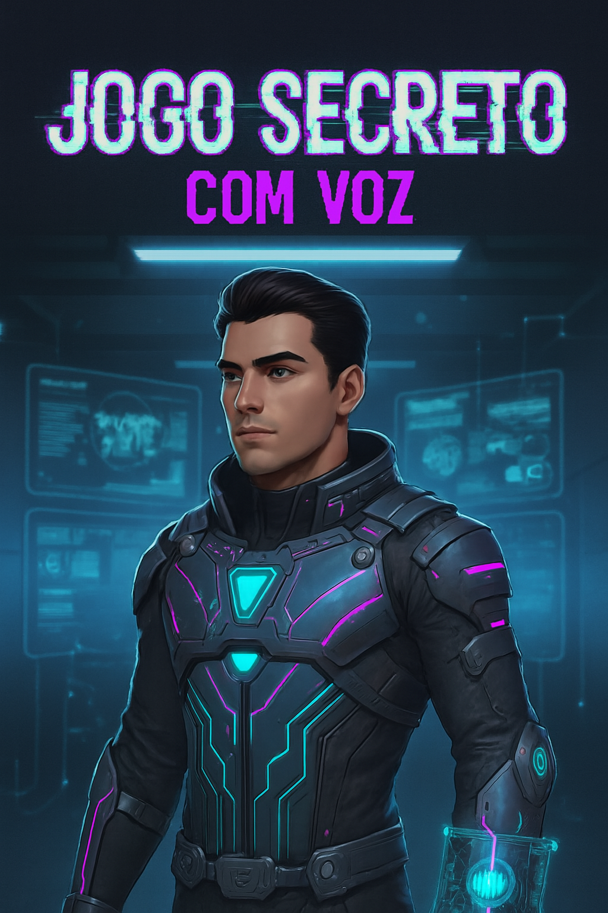

# 👾 Jogo Secreto com Voz

Projeto de adivinhação interativo com **interação de voz**, desenvolvido para fins de entretenimento e aprendizado.

---
## 🎥 Demonstração em Vídeo

[](https://youtu.be/hdlYnjVOuH4)

Clique na imagem acima para assistir à demonstração completa do projeto no YouTube!


## 📊 Estatísticas do Projeto

| ⭐ Estrelas | 📦 Commits | 🔧 Pull Requests | 🐞 Issues | 🌍 Contribuições | 🏆 Nota Geral |
|------------|------------|------------------|-----------|------------------|----------------|
| 2          | 222        | 1                | 0         | 1                | A+             |

---

## 🧠 Tecnologias Utilizadas

### 🖥️ Front-End


---

## 🎁 Funcionalidades

- Interface amigável  
- Interação de voz para entrada de dados  
- Feedback visual e sonoro  

---

## 🚀 Como Executar
Para uma melhor experiência com a interação de voz, recomendo utilizar o navegador Google Chrome.

1. Clone o repositório:
   ```bash
   git clone https://github.com/Esparta009boy/js-jogo-secreto-jovem-dev1.git

